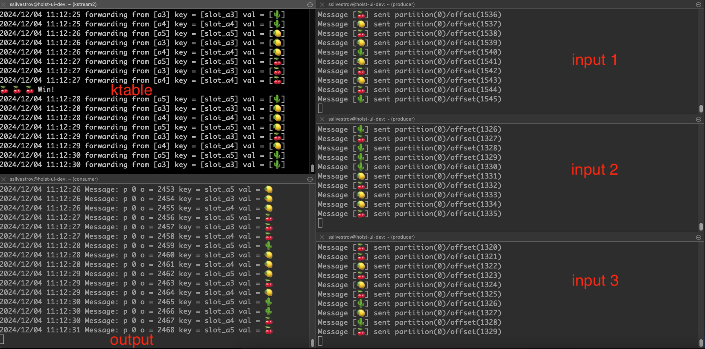
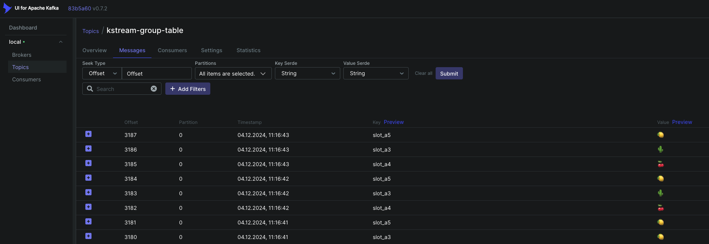

## Домашнее задание от 27 нобяря 2024

Помимо пробных примеров с использованием DSL попробовал Kafka Streams с принением Golang скрипта с использованием пакета github.com/lovoo/goka (с saramahttps://github.com/IBM/sarama под капотом). Запускалось на кластере с KRaft

Функционал:
- объединение логов от трех источников в один выходной лог.
- агрегатор в ktable c отображением в materialized view


Kafka Streams
```
go run kstream/kstream.go
```

Producter (Emitter)
```
go run go run producer/producer.go -id=a3 -p=1 -r=3
go run go run producer/producer.go -id=a4 -p=1 -r=3
go run go run producer/producer.go -id=a5 -p=1 -r=3
```

Group Consumer (Sink)
```
go run consumer/consumer.go -id=output3
```


## Результат



